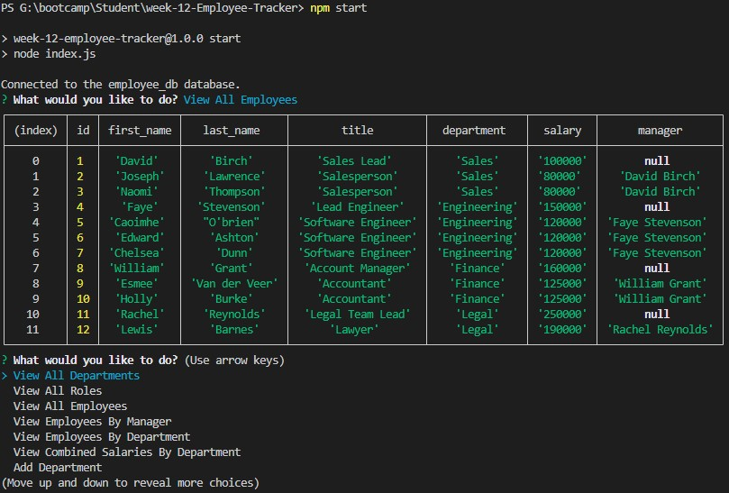

# week-12-Employee-Tracker

## Purpose of Task

Creation of a command line application to allow a user to view, update and delete records from an employee database. This application will make use of Node.js, Inquirer and MySQL.

## Table of Contents

* [User Story](#user-story)

* [Acceptance Criteria](#acceptance-criteria)

* [Problems Solved](#problems-solved)

* [Usage](#usage)

* [Screenshot](#screenshot)

* [Demonstration Video](#demonstration-video)

## User Story

```md
AS A business owner
I WANT to be able to view and manage the departments, roles, and employees in my company
SO THAT I can organize and plan my business
```

## Acceptance Criteria

```md
GIVEN a command-line application that accepts user input
WHEN I start the application
THEN I am presented with the following options: view all departments, view all roles, view all employees, add a department, add a role, add an employee, and update an employee role
WHEN I choose to view all departments
THEN I am presented with a formatted table showing department names and department ids
WHEN I choose to view all roles
THEN I am presented with the job title, role id, the department that role belongs to, and the salary for that role
WHEN I choose to view all employees
THEN I am presented with a formatted table showing employee data, including employee ids, first names, last names, job titles, departments, salaries, and managers that the employees report to
WHEN I choose to add a department
THEN I am prompted to enter the name of the department and that department is added to the database
WHEN I choose to add a role
THEN I am prompted to enter the name, salary, and department for the role and that role is added to the database
WHEN I choose to add an employee
THEN I am prompted to enter the employee’s first name, last name, role, and manager, and that employee is added to the database
WHEN I choose to update an employee role
THEN I am prompted to select an employee to update and their new role and this information is updated in the database 
```

## Problems Solved

- When the user run the application, they are presented with the options specified in the acceptance criteria as well as the following options: **View Employees By Manager**, **View Employees By Department**, **View Combined Salaries By Department**, **Update Employee Manager**, **Delete Department**, **Delete Role** and **Delete Employee**
- Choosing to view all departments will return a table showing department ids and names
- Choosing to view all roles will return a table showing the role title, id and salary and the department name for that role
    - Roles that are not part of a department will still appear in the list of all roles, however this is mostly just for visibility when looking for roles to delete
- Choosing to view all employees will return a table showing employee id, first name, last name, role, department, salary and their manager (if they have one)
    - For employees without a manager, the manager column will display null
- Choosing to add a department will prompt the user to enter the name of the new department, which is then added to the database
- Choosing to add a role will prompt the user to enter the name, salary and department for the role, which is then added to the database
    - If the user attempts to enter anything other than a number for the salary, they receive an error message and must enter a number before continuing
        - The value will display as NaN in the terminal, pressing the up arrow should clear this
- Choosing to add an employee will prompt the user to enter the employee's first and last name and then choose their role and manager. The employee is then added to the database
    - Only roles that exist as part of a department will appear in the list of assignable roles
- Choosing to update an employee role will prompt the user to choose the employee they wish to update and then ask the user to chooes their new role, this is then updated accordingly in the database
- Choosing to delete a department will prompt the user to choose the department they wish to remove, this department will then be removed from the database
    - All delete actions have a confirmation check before deleting the selected data
    - Any employees that were a part of that department will still appear in the list of employees alongside their role for the sake of clarity, however this role will no longer be assignable
- Choosing to delete a role will prompt the user to choose the role they wish to remove, this role is then removed from the database
    - Roles that are not part of a department will appear in this list so that they can be deleted
    - Any employees that had that role will still appear in the list of employees for the sake of clarity
- Choosing to delete an employee will prompt the user to choose the employee they wish to remove, this employee's record is then removed from the database

## Usage

- Type **npm i** in the terminal to ensure that the correct dependencies have been installed
- Navigative to db/queries.js and enter your details where it says const db = mysql.createConnection so that you can connect to the database
    - These will be the same details you use to login to the MySQL shell
- Type **mysql -u USERNAME -p**, where USERNAME is replaced by your username (for me this is root) in the terminal to login to MySQL shell
    - Once in MySQL shell, to set up the database type **source db/schema.sql** and press enter
    - To seed the database, type **source db/seeds.sql** and press enter
    - You can then type **quit** to leave MySQL shell
- Type **npm start** to run the application, from here you will be prompted to select which action you'd like to take
- You can close the application from the main menu by choosing the **Quit** option, or by pressing Ctrl + C

## Screenshot

 

## Demonstration Video

A demonstration video is availabe here: https://drive.google.com/file/d/1Ktr3IcsNBRxpGKiMkGTIZRac7WzEcG1W/view